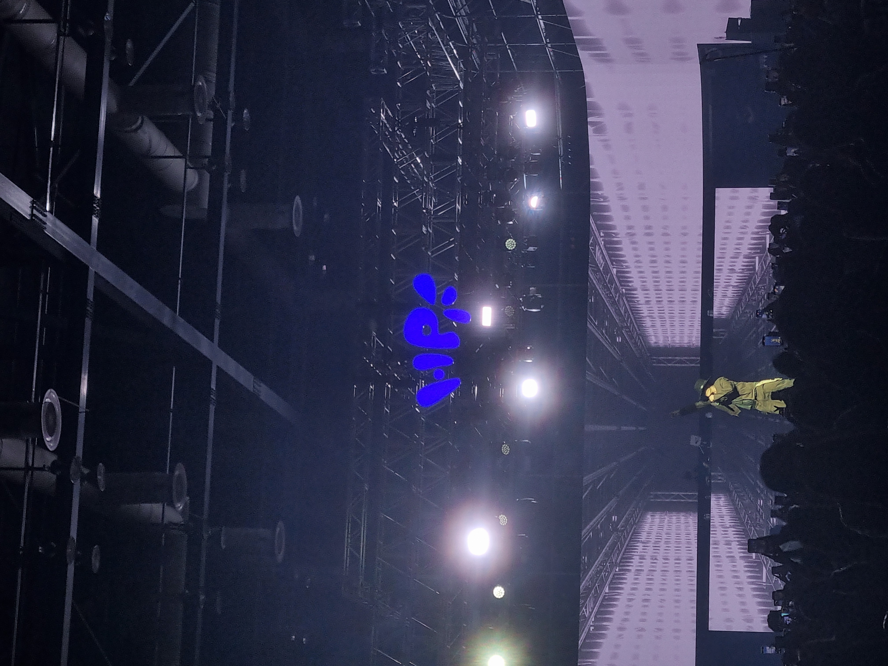

  

  CS Student

  
  
  

---
## 👩‍💻 About Me
- working on first project using Android studio, kotlin
  
## 🎯 Goals for This Year
- goal 1 : get familiar with Git
- goal 2 : master Overwatch 2 healer Ana

## 🧱 Tech (learning)
`Kotlin` · `Android` · `C`

## 🗂️ Repository
- **Practice** – Android/Kotlin study commits
- **C_Workspace** – C language learning note & backjoon
---

---

<!-- 푸터 -->

  Last update: <!-- 자동화 안쓰면 수동으로 날짜 적기 --> 2025-09-28

